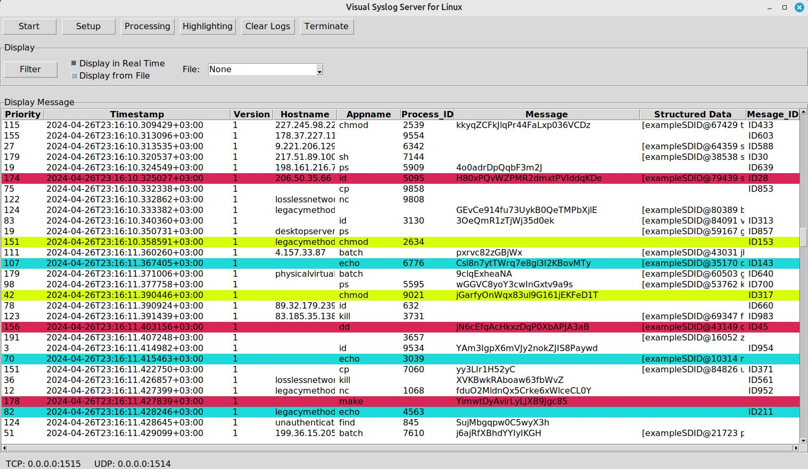
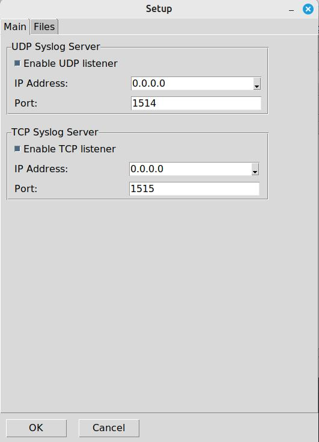
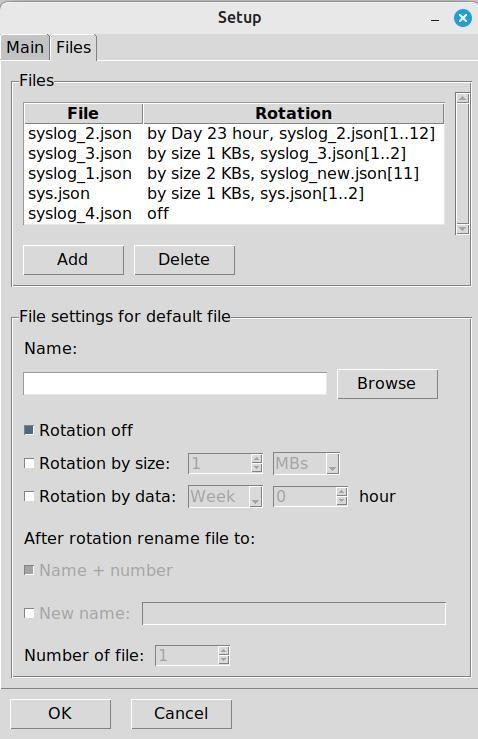
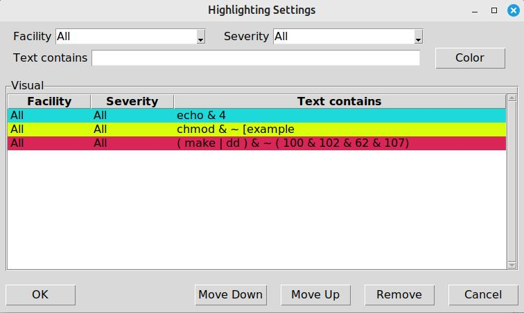
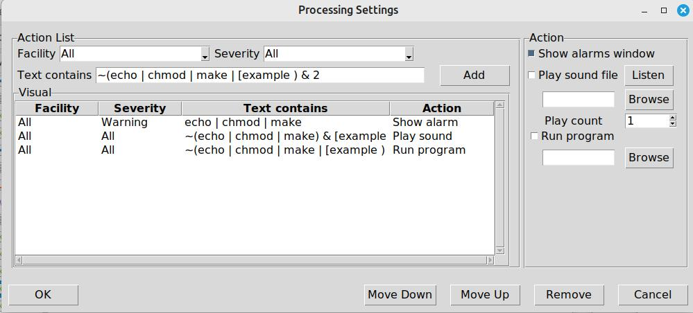
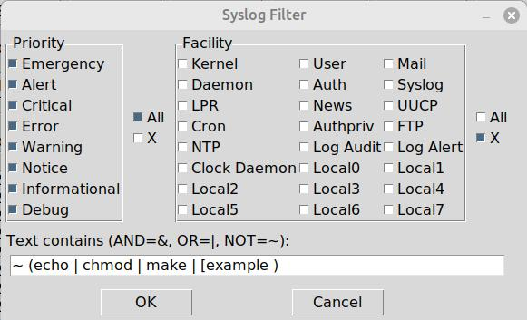

# f0ma

## Description
A powerful tool for collecting logs from various devices, providing tools for effective monitoring and analysis of system events.

## Installation and launch

### Windows
1. Download and unpack the project.
2. Open a command prompt and go to your project folder.
3. Run the batch script:
    ```cmd
    run_windows.bat
    ```

### Unix/Linux/MacOS
1. Download and unpack the project.
2. Open a terminal and go to your project folder.
3. Make the script executable 
   ```bash
    chmod +x run_unix.sh
   ```
4. Run the script
   ```bash
    ./run_unix.sh
    ```
## Screenshots

### Interface of the "Visual syslog server by f0ma""


### Connection settings window


### Rotation settings window


### Color selection window


### Reaction settings window


### Filtering settings window


